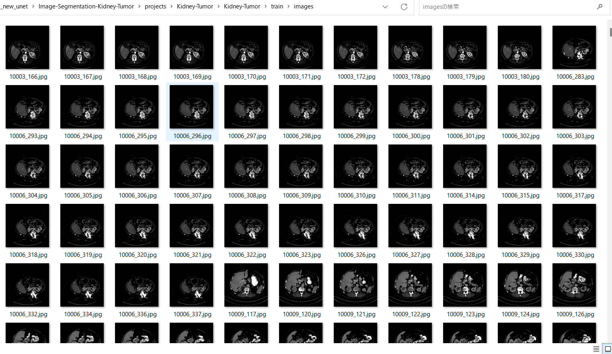
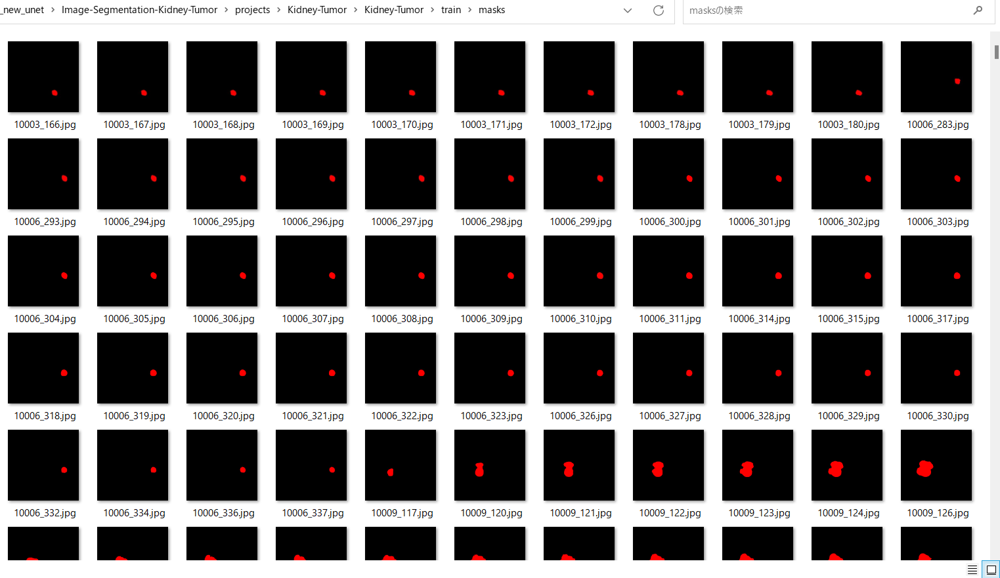
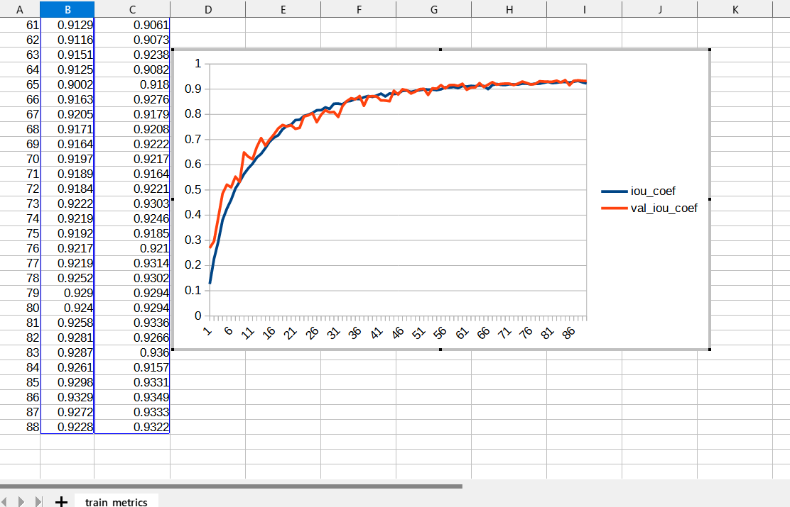
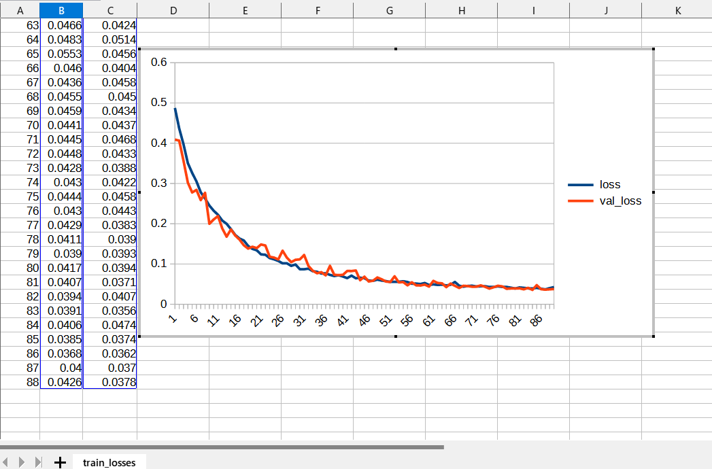
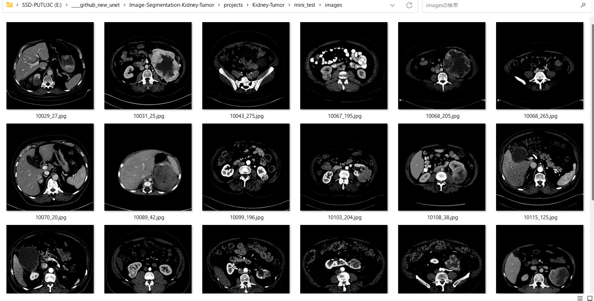
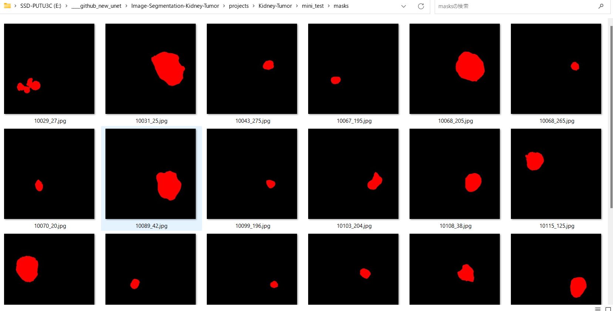
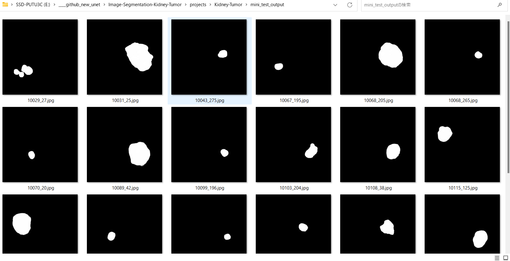
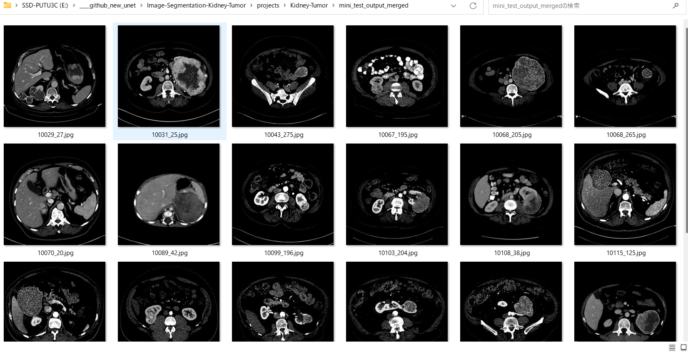
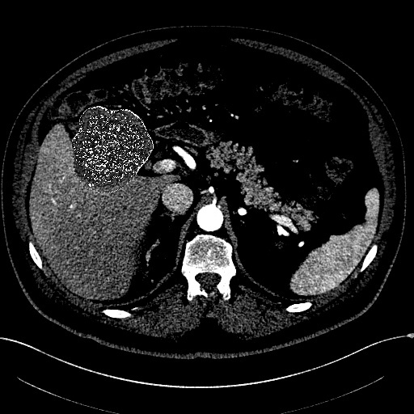

# Image-Segmentation-Kidney-Tumor (2023/08/10)
<h2>
1 Image-Segmentation-Kidney-Tumor 
</h2>

This is an experimental project for Image-Segmentation of Kidney-Tumor by using
 <a href="https://github.com/atlan-antillia/Tensorflow-Slightly-Flexible-UNet">Tensorflow-Slightly-Flexible-UNet</a> Model,
which is a typical classical Tensorflow2 UNet 2D implementation <a href="./TensorflowUNet.py">TensorflowUNet.py</a> 

The image dataset used here has been taken from the following web site.

<b>The official [2019 KiTS Challenge]</b>
<pre>
https://kits19.grand-challenge.org
</pre>
 
<b>The official 2019 KiTS Challenge repository.</b>
<pre>
https://github.com/neheller/kits19
</pre>

Please see also: <a href="https://kits-challenge.org/kits23/">[KiTS23 Homepage]</a> 
 

<a href="https://kits19.grand-challenge.org/data/"><b>Challenge Data</b></a>
 
 
<b>License: </b>
<pre>
The following applies to all content in this repository EXCEPT that within 
the data/ subdirectory.

MIT License

Copyright (c) 2019 Nicholas Heller

Permission is hereby granted, free of charge, to any person obtaining a copy
of this software and associated documentation files (the "Software"), to deal
in the Software without restriction, including without limitation the rights
to use, copy, modify, merge, publish, distribute, sublicense, and/or sell
copies of the Software, and to permit persons to whom the Software is
furnished to do so, subject to the following conditions:

The above copyright notice and this permission notice shall be included in all
copies or substantial portions of the Software.

THE SOFTWARE IS PROVIDED "AS IS", WITHOUT WARRANTY OF ANY KIND, EXPRESS OR
IMPLIED, INCLUDING BUT NOT LIMITED TO THE WARRANTIES OF MERCHANTABILITY,
FITNESS FOR A PARTICULAR PURPOSE AND NONINFRINGEMENT. IN NO EVENT SHALL THE
AUTHORS OR COPYRIGHT HOLDERS BE LIABLE FOR ANY CLAIM, DAMAGES OR OTHER
LIABILITY, WHETHER IN AN ACTION OF CONTRACT, TORT OR OTHERWISE, ARISING FROM,
OUT OF OR IN CONNECTION WITH THE SOFTWARE OR THE USE OR OTHER DEALINGS IN THE
SOFTWARE.
</pre>

<li>
2023/08/10 Updated ImageMaskDatasetGenerator.py to be agle to generate an enhanced master-dataset.
</li>

 
<h2>
2. Install Image-Segmentation-Kidney-Tumor 
</h2>
Please clone Image-Segmentation-Kidney-Tumor.git in a folder <b>c:\google</b>. 
<pre>
>git clone https://github.com/sarah-antillia/Image-Segmentation-Kidney-Tumor.git 
</pre>
You can see the following folder structure in your working folder. 

<pre>
Image-Segmentation-Kidney-Tumor 
├─asset
└─projects
    └─-Kidney-Tumor
        ├─eval
        ├─generator
        ├─mini_test
        ├─models
        ├─Kidney-Tumor
        │   ├─test
        │   │  ├─images
        │   │  └─masks
        │   ├─train
        │   │  ├─images
        │   │  └─masks
        │   └─valid
        │       ├─images
        │       └─masks
        ├─test_output
        └─test_output_merged
</pre>

<h2>
3 Prepare dataset
</h2>

<h3>
3.1 Download master dataset
</h3>
  Please download the original image and mask dataset <b>kits19</b> by running the following commands. 
<pre>
>git clone https://github.com/neheller/kits19
>cd kits19
>pip install -r requirements.txt
>python -m starter_code.get_imaging
</pre>

The dataset <b>kits19</b> has the following folder structure. 
<pre>
./kits19
├─data
│  ├─case_00000
│  ├─case_00001
│  ├─case_00002
│  ├─case_00003
│  ├─case_00004
...
│  ├─case_00298
│  └─case_00299
└─starter_code
    
</pre>
Each case_* folder contains two types of nii.gz files, which include images and segmentations data.  
<pre>
imaging.nii.gz
segmentation.nii.gz
</pre>

<h3>
3.2 Create base dataset
</h3>
By using Python script <a href="./projects/Kidney-Tumor/generator/create_base_dataset.py">create_base_dataset.py</a>,
 we have created <b>Kits19-base</b> jpg dataset from the *.nii.gz files in data/case_* folders. 

<pre>
./Kits19-base
├─images
└─masks
</pre>

<h3>
3.3 Create augmented image and mask dataset
</h3>
By using Python script <a href="./projects/Kidney-Tumor/generator/ImageMaskDatasetGenerator.py">ImageMaskDatasetGenerator.py</a>,
 we have created <b>Kits19-master</b> dataset from <b>Kits19-base</b> dataset. 
The script performs the following image processings. 
<pre>
1 Select mask files having an adequately large bounding box around each segmentated region.
2 Select image files corresponding to the selected mask files. 
3 Create flipped and mirrored mask and image files from the selected masks and images.
</pre>

The created <b>Kits19-master</b> dataset has the following folder structure. 
<pre>
./Kits19-master
├─images
└─masks
</pre>

<h3>
3.4 Split master to test, train and valid 
</h3>
By using Python script <a href="./projects/Kidney-Tumor/generator/split_master.py">split_master.py</a>,
 we have finally created <b>Kidney-Tumor</b> dataset from the Kidney-Tumor-master. 
<pre>
./Kidney-Tumor
├─test
│  ├─images
│  └─masks
├─train
│  ├─images
│  └─masks
└─valid
    ├─images
    └─masks
</pre>
<b>train/images samples:</b> 

 
<b>train/masks samples:</b> 

 

<h2>
4 Train TensorflowUNet Model
</h2>
 We have trained Kidney-Tumor TensorflowUNet Model by using the following
 <b>train_eval_infer.config</b> file.  
Please move to ./projects/Kidney-Tumor directory, and run the following bat file. 
<pre>
>1.train.bat
</pre>
, which simply runs the following command. 
<pre>
>python ../../TensorflowUNetTrainer.py ./train_eval_infer.config
</pre>
, where train_eval_infer.config is the following.
<pre>
; train_eval_infer.config
; Dataset of Kidney-Tumor
; 2023/08/10 (C) antillia.com

[model]
image_width    = 512
image_height   = 512
image_channels = 3
num_classes    = 1
base_filters   = 16
base_kernels   = (7, 7)
num_layers     = 6
dropout_rate   = 0.07
learning_rate  = 0.0001
clipvalue      = 0.5
dilation       = (2,2)
loss           = "bce_iou_loss"
;metrics        = ["iou_coef", "sensitivity", "specificity"]
metrics        = ["iou_coef"]
show_summary   = False

[train]
epochs        = 100
batch_size    = 4
patience      = 10
metrics       = ["iou_coef", "val_iou_coef"]
model_dir     = "./models"
eval_dir      = "./eval"
image_datapath = "./Kidney-Tumor/train/images"
mask_datapath  = "./Kidney-Tumor/train/masks"
create_backup  = True

[eval]
;image_datapath = "./Kidney-Tumor/valid/images"
;mask_datapath  = "./Kidney-Tumor/valid/masks"
image_datapath = "./mini_eval/images"
mask_datapath  = "./mini_eval/masks"
output_dir     = "./eval_output"

[infer] 
images_dir = "./mini_test/images"
output_dir = "./mini_test_output"
merged_dir = "./mini_test_output_merged"

[mask]
blur      = True
binarize  = True
threshold = 50
</pre>

Please note that the input image size and base_kernels size of this TensorflowUNet model are slightly large. 
<pre>
[model]
image_width    = 512
image_height   = 512
base_kernels   = (7,7)
</pre>

The training process has just been stopped at epoch 50 by an early-stopping callback as shown below.  
 
 
 
<b>Train metrics line graph</b>: 
 
 
<b>Train losses line graph</b>: 
 

<h2>
5 Evaluation
</h2>
 We have evaluated prediction accuracy of our Pretrained Kidney-Tumor Model by using 
 <a href="./projects/Kidney-Tumor/mini_eval"><b>mini_eval</b></a> dataset. 
Please move to ./projects/Kidney-Tumor/ directory, and run the following bat file. 
<pre>
>2.evalute.bat
</pre>
, which simply runs the following command. 
<pre>
>python ../../TensorflowUNetEvaluator.py ./train_eval_infer.config
</pre>
The evaluation result is the following. 
 
 
 
<h2>
6 Inference 
</h2>
We have also tried to infer the segmented region for 
<pre>
images_dir    = "./mini_test/images" 
</pre> dataset defined in <b>train_eval_infer.config</b>,
 by using our Pretrained Kidney-Tumor UNet Model. 
Please move to ./projects/Kidney-Tumor/ directory, and run the following bat file. 
<pre>
>3.infer.bat
</pre>
, which simply runs the following command. 
<pre>
>python ../../TensorflowUNetInferencer.py ./train_eval_infer.config
</pre>

<b><a href="./projects/Kidney-Tumor/Kidney-Tumor/mini_test/images">Mini test input images</a> </b> 
 
 
<b><a href="./projects/Kidney-Tumor/Kidney-Tumor/mini_test/masks">Mini test input ground truth mask</a> </b> 
 
 

<b><a href="./projects/mini_test_output/">Inferred images </a>Mini test output</b> 
 
 
 

<b><a href="./projects/Kidney-Tumor/mini_test_output_merged">Inferred merged images (blended mini_test/images with 
inferred images)</a></b> 
  

<b>Some enlarged input images and inferred merged images</b> 
<table>
<tr><td>Input:10029_27.jpg</td><td>Inferred merged:10029_27.jpg</td></tr>
<tr>
<td></td>
<td></td>
</tr>

<tr><td>Input:10031_25.jpg</td><td>Inferred merged:10031_25.jpg</td></tr>
<tr>
<td></td>
<td></td>
</tr>

<tr><td>Input:10043_275.jpg</td><td>Inferred merged:10043_275.jpg</td></tr>
<tr>
<td></td>
<td></td>
</tr>

<tr><td>Input:10115_125.jpg</td><td>Inferred merged:10115_125.jpg</td></tr>
<tr>
<td></td>
<td></td>
</tr>
<tr><td>Input:10203_138.jpg</td><td>Inferred merged:10203_138.jpg</td><tr>
<tr>
<td></td>
<td></td>
</tr>
<tr><td>Input:10152_849.jpg</td><td>Inferred merged:10152_849.jpg</td><tr>
<tr>
<td></td>
<td></td>
</tr>
</table>

 
<h3>
References
</h3>

<b>1. The official [2019 KiTS Challenge] </b> 
<pre>
https://kits19.grand-challenge.org
</pre>
<b>2. The official 2019 KiTS Challenge repository.</b> 
<pre>
https://github.com/neheller/kits19
</pre>
<b>3. The state of the art in kidney and kidney tumor segmentation in contrast-enhanced CT imaging: Results of the KiTS19 challenge</b> 
Nicholas Heller, Fabian Isensee, Klaus H. Maier-Hein, Xiaoshuai Hou,  
Chunmei Xie, Fengyi Li, Yang Nan, Guangrui Mu, Zhiyong Lin,  
Miofei Han, Guang Yao, Yaozong Gao, Yao Zhang, Yixin Wang, Feng Hou,  
Jiawei Yang, Guangwei Xiong, Jiang Tian, Cheng Zhong, Jun Ma, Jack Rickman, 
Joshua Dean, Bethany Stai, Resha Tejpaul, Makinna Oestreich, Paul Blake,  
Heather Kaluzniak, Shaneabbas Raza, Joel Rosenberg, Keenan Moore, Edward Walczak,  
Zachary Rengel, Zach Edgerton, Ranveer Vasdev, Matthew Peterson, Sean McSweeney, 
Sarah Peterson, Arveen Kalapara, Niranjan Sathianathen, Nikolaos Papanikolopoulos, 
Christopher Weight 
<pre>
https://www.sciencedirect.com/science/article/abs/pii/S1361841520301857?via%3Dihub
</pre>

<b>4. Kidney Tumor Segmentation Based on FR2PAttU-Net Model</b> 
Peng Sun, Zengnan Mo, Fangrong Hu, Fang Liu, Taiping Mo, Yewei Zhang and Zhencheng Chen 
<pre>
https://www.frontiersin.org/journals/oncology/articles/10.3389/fonc.2022.853281/full
</pre>

<b>5. MSS U-Net: 3D segmentation of kidneys and tumors from CT images with a multi-scale supervised U-Net</b> 
Wenshuai Zhao, Dihong Jiang, Jorge Peña Queralta, Tomi Westerlund 
<pre>
https://www.sciencedirect.com/science/article/pii/S2352914820301969
</pre>

